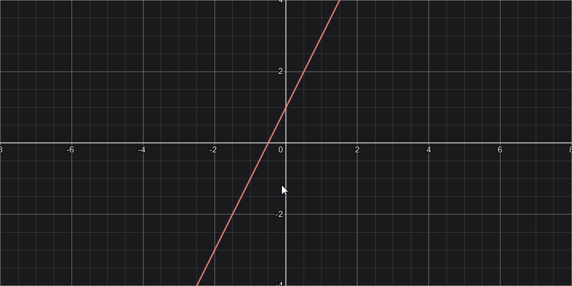
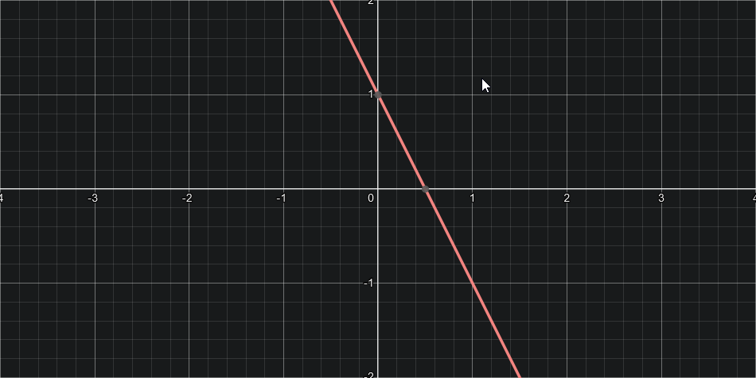

# Funkcje
## Liniowa
**Wzór ogólny:**  
$f(x) = ax + b$  
$y = ax + b$  
- **a -** współczynnik kierunkowy prostej
- **b -** wyraz wolny
  
  
> Wykres funkcji $y = 2x + 1​$

### Monotoniczność funkcji
- Rosnąca (a > 0)  
  

- Malejąca (a < 0)  
  

- Stała (a = 0)  
  

---
### Miejsce zerowe
> Przykład dla funkcji $f(x) = 5x - 15$​

**Ze wzoru:**  
$x_0 = -{b \over a}$  

$x_0 = -{-15 \over 5}$  
$x_0 = {15 \over 5}$  
$x_0 = 3$  

**Przyrównujemy wzór funkcji do zera:**  
$5x - 15 = 0$  
$5x = 15$  
$x = 3$  
$x_0 = 3$  
