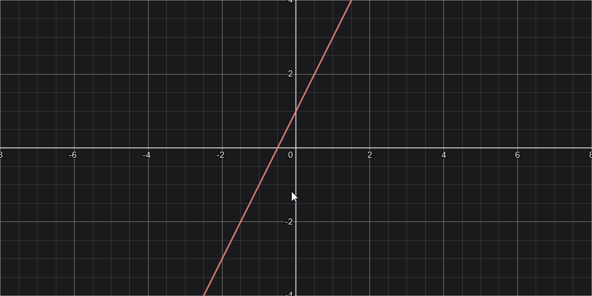
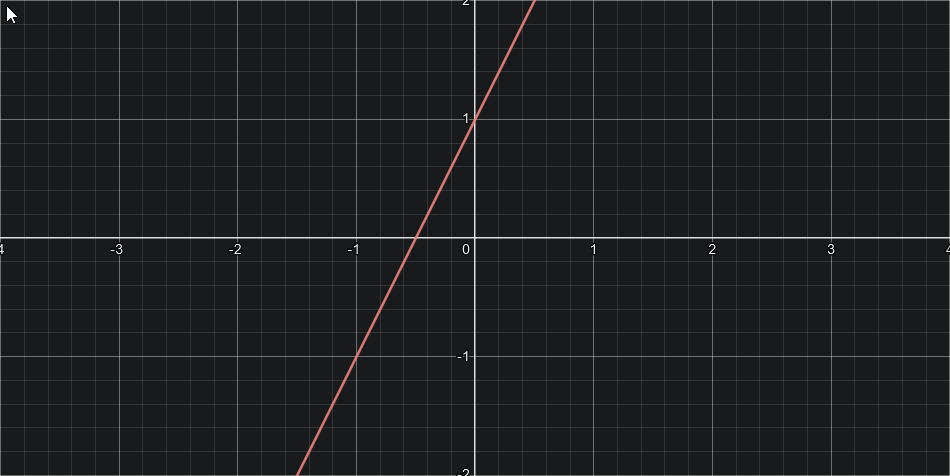
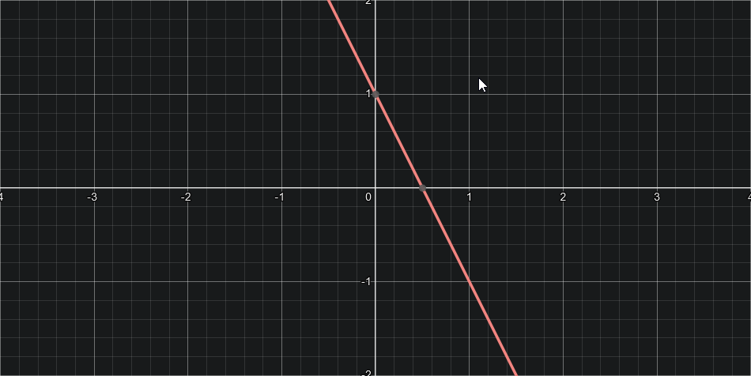
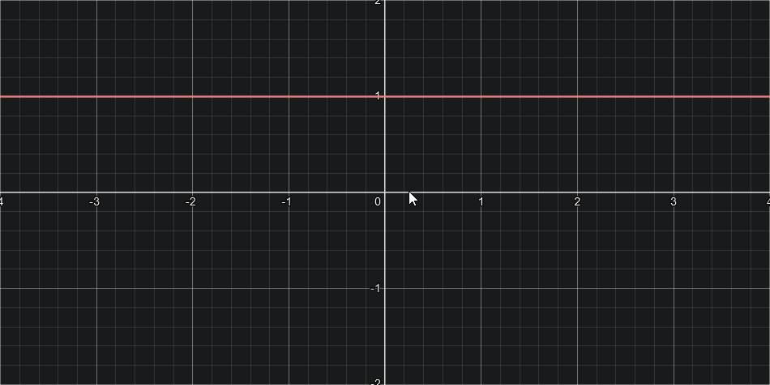
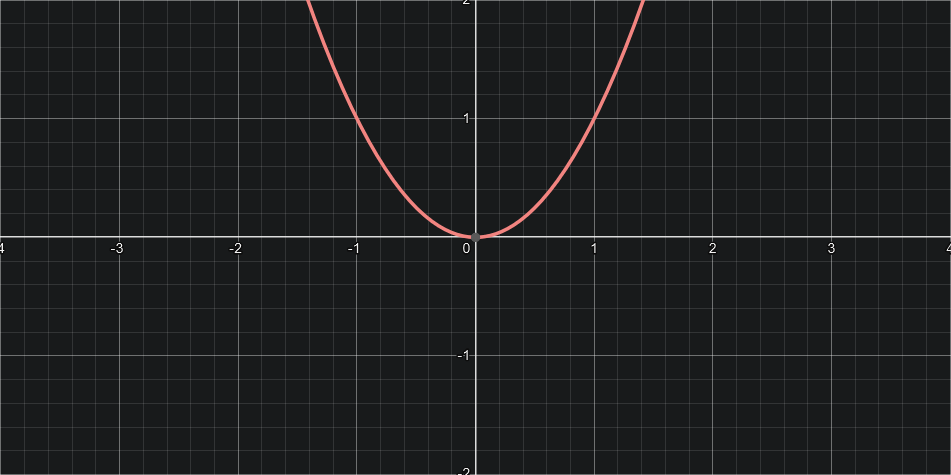
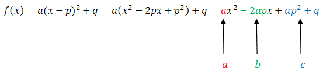
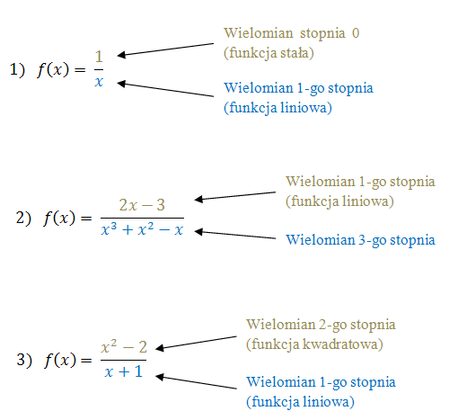
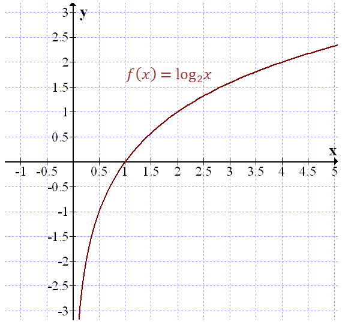
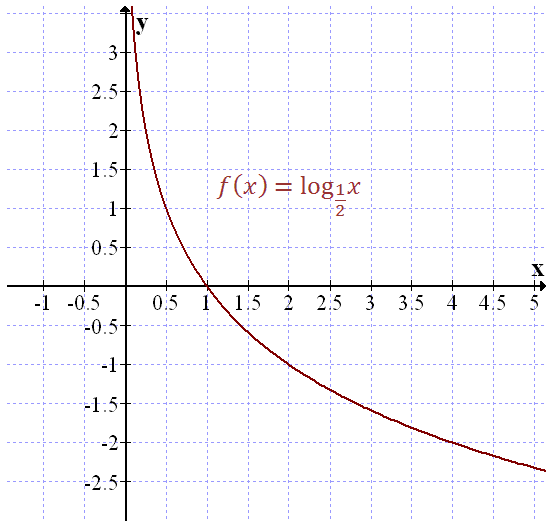

# Funkcje
## Liniowa
**Wzór ogólny:**  
$f(x) = ax + b$  
$y = ax + b$  
- **a -** współczynnik kierunkowy prostej
- **b -** wyraz wolny
  
  
> Wykres funkcji $y = 2x + 1​$

### Monotoniczność funkcji
- Rosnąca (a > 0)  
  

- Malejąca (a < 0)  
  

- Stała (a = 0)  
  

---
### Miejsce zerowe
> Przykład dla funkcji $f(x) = 5x - 15$​

**Ze wzoru:**  
$x_0 = -{b \over a}$  

$x_0 = -{-15 \over 5}$  
$x_0 = {15 \over 5}$  
$x_0 = 3$  

**Przyrównujemy wzór funkcji do zera:**  
$5x - 15 = 0$  
$5x = 15$  
$x = 3$  
$x_0 = 3$  

## Kwadratowa
**Wzór ogólny:**  
$f(x) = ax^2 + bx + c$  
$y = ax^2 + bx + c$  

Gdzie _a_, _b_ oraz _c_ są współczynnikami liczbowymi  
Wykresem każdej funkcji kwadratowej jest **parabola**

**Funkcją kwadratową nazywamy taką funkcję, we wzorze której:**  
- musi wystąpić $x^2$
- może wystąpić $x$
- może wystąpić liczba stała

---

> Wykres funkcji $f(x) = x^2​$

| x | -2 | -1 | 0 | 1 | 2 |
| ---- | ---- | ---- | ---- | ---- | ---- |
| $f(x) = x^2$ | 4 | 1 | 0 | 1 | 4 |

---

### Monotoniczność funkcji:
Ta funkcja może być monotoniczna tylko przedziałami, gdyż jest to parabola więc z jednej strony rośnie, a z drugiej maleje

### Kierunek wykresu funkcji:
Zależy od wartości a jeżeli jest ona:
- dodatnia to wykres idzie w górę
- ujemna to wykres idzie w dół

### Miejsca zerowe (rozwiązania) funkcji:
> Rozwiązanie zadania dla funkcji $f(x) = x^2 + 5x + 6​$  

**Przyrównujemy wzór funkcji do zera i rozwiązujemy równanie:**  
$x^2 + 5x + 6 = 0$  

**Wyliczamy deltę:**  
$Δ = 5^2 − 4 ⋅ 1 ⋅ 6 = 25 − 24 = 1$  
$√Δ = √1 = 1$  

**Wyliczamy rozwiązania:**  
$x_1 = {−b −√Δ \over 2a} = {−5 −1 \over 2 ⋅ 1} = {−6 \over 2} = −3$  
$x_2 = {−b +√Δ \over 2a} = {−5 + 1 \over 2 ⋅ 1} = {−4 \over 2} = −2$  

$x_1 = -3$  
$x_2 = -2$  

Odp: Miejscami zerowymi funkcji f(x) są $x = -3$ oraz $x = -2$  

---

### Równanie osi symetrii:
$x={−b \over 2a}$  

Oś symetrii paraboli zawsze przechodzi przez wierzchołek paraboli.  

---

### Postacie funkcji kwadratowej:
- **Postać ogólna**  
  $f(x) = ax^2 + bx + c$  

Gdzie _a_, _b_, _c_ są współczynnikami liczbowymi i _a_ ≠ 0  

Ze wzoru funkcji kwadratowej w postaci ogólnej możemy odczytać  
- Czy ramiona paraboli są skierowane do góry ($a>0$), czy do dołu ($a<0$),  
- Punkt przecięcia paraboli z osią $OY$, który ma współrzędne $(0,c)$.  

Miejsca zerowe obliczamy z delty Δ  

Obliczenie wierzchołka wykresu obliczamy za pomocą wzoru:
$W=({−b \\over 2a} , {−Δ \\over 4a})$

- **Postać kanoniczna  
  $f(x) = a(x - p)^2 + q$  

Gdzie _a_, _p_, _q_ są współczynnikami liczbowymi i _a_ ≠ 0

Współczynniki _p_ i _q_ są współrzędnymi wierzchołka paraboli, będącej wykresem funkcji kwadratowej. Oznaczmy ten wierzchołek przez $W=(p,q)$. Jeżeli znamy postać ogólną funkcji kwadratowej, to możemy obliczyć współrzędne _p_ i _q_ ze wzorów:  
$p = {-b \over 2a}$                  $q = {-Δ \over 4a}$

Zaletą postaci kanonicznej jest to, że widać z niej od razu współrzędne wierzchołka paraboli.

Dodatkowo po współczynniku a możemy określić, czy ramiona paraboli są skierowane do góry (a>0), czy do dołu (a<0).

- **Postać iloczynowa**  
  $f(x) = a(x - x_1)(x - x_2)$  

W powyższym wzorze $a$ jest współczynnikiem liczbowym, takim, że $a≠0$. $x_1$ i $x_2$ są miejscami zerowymi funkcji $f(x)$.

Zaletą postaci iloczynowej jest to, że widać z niej od razu miejsca zerowe funkcji kwadratowej.

Po współczynniku _a_ możemy określić również, czy ramiona paraboli są skierowane do góry (_a_>0), czy do dołu (_a_<0).

---

### Zamiana postaci funkcji kwadratowej:
**Zamiana postaci ogólnej na kanoniczną**  
Żeby zamienić wzór funkcji kwadratowej na postać kanoniczną, to wystarczy obliczyć _p_ i _q_.  
$p = {-b \over 2a}$ $q = {-Δ \over 4a}$  

Po wyliczeniu _p_ i _q_ zapisujemy wzór funkcji w postaci kanonicznej korzystając ze wzoru, ponieważ a mamy z wzoru w postaci ogólnej:  
$f(x)=a(x−p)^2+q$  

**Zamiana postaci ogólnej na iloczynową**  
Żeby zamienić wzór funkcji kwadratowej na postać iloczynową, to należy obliczyć $x_1$ i $x_2$. Liczymy deltę ze wzoru:  
$Δ=b^2−4ac$  

$x_1 = {−b −√Δ \over 2a}$  
$x_2 = {−b +√Δ \over 2a}$  

Po wyliczeniu $x_1$ i $x_2$ zapisujemy wzór funkcji w postaci iloczynowej korzystając ze wzoru:  
$f(x)=a(x−x_1)(x−x_2)$  

Jeżeli Δ=0, to wystarczy policzyć $x_0$ ze wzoru:  
$x_0={−b \over 2a}$  

Postać iloczynową możemy wówczas zapisać krócej:  
$f(x)=a(x−x_1)^2$  

**Zamiany postaci kanonicznej na ogólną**  
Żeby zamienić wzór funkcji kwadratowej na **postać ogólną**, to wystarczy podnieść nawias do kwadratu i uprościć wyrażenie:  

Możemy zatem zapisać wzory na współczynniki liczbowe _b_ i _c_:  
$b=−2ap$  
$c=ap^2+q$  

Teraz gdy znamy współczynniki liczbowe _a_, _b_ i _c_, to możemy zapisać wzór funkcji w postaci ogólnej:  
$f(x)=ax^2+bx+c$  

**Zamiana postaci kanonicznej na iloczynową**
Aby zamienić wzór funkcji z postaci kanonicznej na **postać iloczynową**, to wystarczy obliczyć miejsca zerowe $x_1$ i $x_2$.  

Żeby to zrobić, to warto najpierw zamienić wzór funkcji na postać ogólną, a następnie obliczyć miejsca zerowe korzystając z delty i wzorów na $x_1$ oraz $x_2$.  

 **Zamiana postaci iloczynowej na postać ogólną**  
Aby zamienić wzór funkcji na postać ogólną, to wystarczy wymnożyć nawiasy:  
$f(x)=a(x−x_1)(x−x_2)$  
$f(x)=a(x^2−x_2x−x_1x+x_1x_2)$  
$f(x)=ax^2−a(x_1+x_2)x+ax_1x_2$  

**Zamiana postaci iloczynowej na postać kanoniczną**  
Przekształcamy najpierw postać iloczynową na postać ogólną  
Następnie z postaci ogólnej wyliczamy współczynniki _p_ i _q_ korzystając ze wzorów  
$p = {-b \over 2a}$                  $q = {-Δ \over 4a}$  

## Wymierna
### Co warto wiedzieć przed:
- [wielomiany](./wielomiany.md)

Funkcja, która jest ilorazem dwóch wielomianów.
Mówiąc inaczej funkcję wymierną, można zapisać w postaci ułamka, który ma w liczniku i mianowniku wielomiany.

**Wzór ogólny**  
$f(x) = {w(x) \over p(x)}$  

Gdzie:
- $w(x)$ - dowolny wielomian
- $p(x)$ - wielomian niezerowy

### Uproszczenie funkcji wymiernej (przykład)
> Przykład dla funkcji $f(x) = {1 \over x} + {3x - 5 \over 2x}$

$f(x) = {1 \over x} + {3x -5 \over 2x}$  

$f(x) = {2 \over 2x} + {3x - 5 \over 2x}$  
$f(x) = {2 + 3x -5 \over 2x}$  
$f(x) = {3x - 3 \over 2x}$  

## Logarytmiczna
**Wzór ogólny**  
$f(x) = log_ax$  

Zakładamy przy tym, że $a > 0$, $a \neq 1$, $x > 0$  

Wykresem tej funkcji jest krzywa która zawsze przecina oś Ox dla argumentu $x = 1$  
Zasadniczy kształt wykresu zależy od tego czy $a > 1$ czy $a < 1$  

> Wykres dla funkcji $f(x) = log_2x$

| x | ${1 \over 4}$ | ${1 \over 2}$ | 1 | 2 | 4 |
| ---- | ---- | ---- | ---- | ---- | ---- |
| $y = log_2x$ | -2 | -1 | 0 | 1 | 2 |

> Wykres dla funkcji $f(x) = log_{1 \over 2}x$

| x | ${1 \over 4}$ | ${1 \over 2}$ | 1 | 2 | 4 |
| ---- | ---- | ---- | ---- | ---- | ---- |
| $y = log_{1 \over 2}x$ | 2 | 1 | 0 | -1 | -2 |
