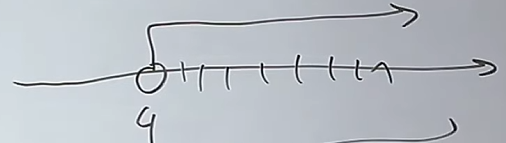

# Przedziały i zbiory
## Zbiory
Jak nazwa wskazuje są to zbiory jakiś elementów, najczęściej są one liczbowe

### Przykłady
$A = \{1,2,3,4,5\}$  
$B = \{2,3,4,5,6,7\}$  

### Działania na zbiorach
$A = \{x: x = 2k, k = 1,2,3,4\}$  
$A = \{2,4,6,8\}$  

Widzimy w tym przykładzie zapis który mówi nam o tym, że we wzorze znajdują się liczby x które powstają poprzez iloczyn liczby 2 i wartości zmiennej k.

### Rodzaje zbiorów
#### Zbiór skończony
$A = \{1, 2, 3, 4\}$  
Wszystkie elementy należące do zbioru są wypisane i skończone
#### Zbiór nieskończony
$B = \{1,2,3,4,...\}$
Elementy nie są wypisane do końca bo jest ich nieskończenie wiele
#### Zbiór pusty
$A = ø$  
Oznacza to, że żadne elementy nie zawierają się we zbiorze
❌ $A = \{ø\}$ - Niepoprawna pisownia oznaczająca że zbiór składa się ze zbioru pustego zamiast, że zbiór nie zawiera elementów  
### Działania na zbiorach
$A = \{1,2,3,4\}$  
$B = \{3,4,5,6\}$  
#### Suma zbiorów
$A \sqcup B = \{1,2,3,4,5,6\}$  
Wszystkie elementy obu zbiorów, bez powtórzeń  
#### Iloczyn zbiorów
$A \sqcap B = \{3,4\}$  
Wszystkie elementy wspólne obu zbiorów
#### Odejmowanie zbiorów
$A / B = \{1 , 2\}$  
$B/A = \{5,6\}$  
Wszystkie elementy które nie powtarzają się w zbiorach. Ważna kolejność, który zbiór jest przed znakiem odejmowania  
### Zbiory rozłączne
$A = \{1,2,3\}$  
$B = \{5,6,7\}$  

$A \sqcap B = ø$
Gdy żaden element nie pojawia się w obu zbiorach  
## Przedziały
### Przedziały ograniczone
  
$2 < x < 6$  
$x \in (2, 6)$  

  
$2 \leqslant x \leqslant 6$  
$x \in <2, 6>$  

  
$2 \leqslant x < 6$  
$x \in <2, 6)$  

  
$2 < x \leqslant 6$  
$x \in (2,6>$  
### Przedziały nieograniczone
  
$x > 4$  
$x \in (4, \infty)$  

  

$x \geqslant 4$  
$x \in <4, \infty)$  

  
$x \leqslant 4$  
$x \in (-\infty, 4>$  

  
$x < 4$  
$x \in (-\infty, 4)$  

### Działania na przedziałach
$A = <-5, 1>$  
$B = (-2, 4)$  
  
#### Dodawanie
$A \sqcup B = <-5, 4)$  
#### Iloczyn
$A \sqcap B = (-2, 1>$  
#### Odejmowanie
$A / B = <-5, -2>$  
$B / A = (1, 4)$  

---

$A = (2,5)$  
$B = (3, \infty)$  
  
#### Dodawanie 2
$A \sqcup B = (2, \infty)$  
#### Iloczyn 2
$A \sqcap B = (3, 5)$  
#### Odejmowanie 2
$A / B = (2, 3>$  
$B / A = <5, \infty)$  

