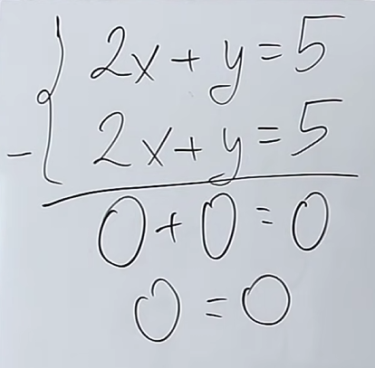
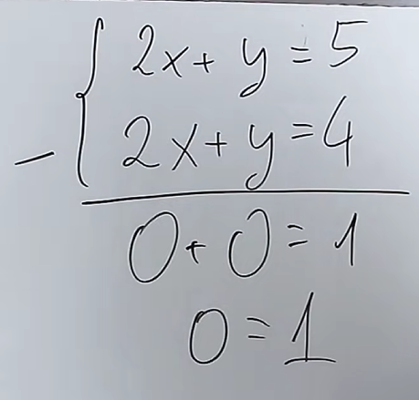
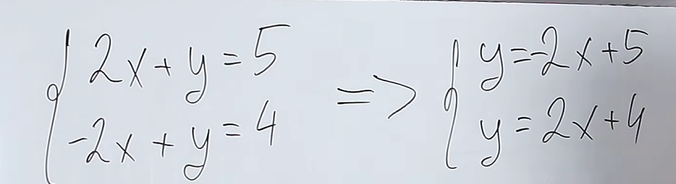
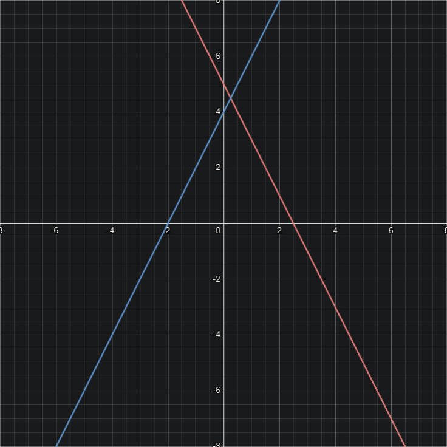
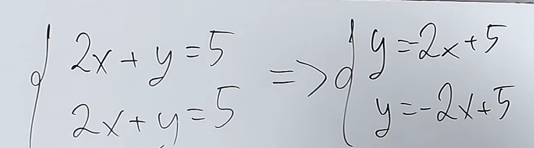
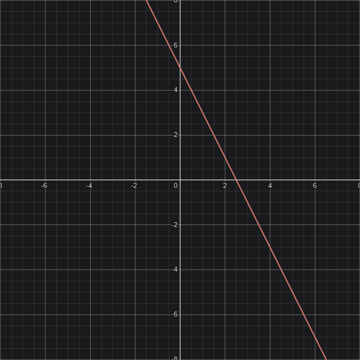
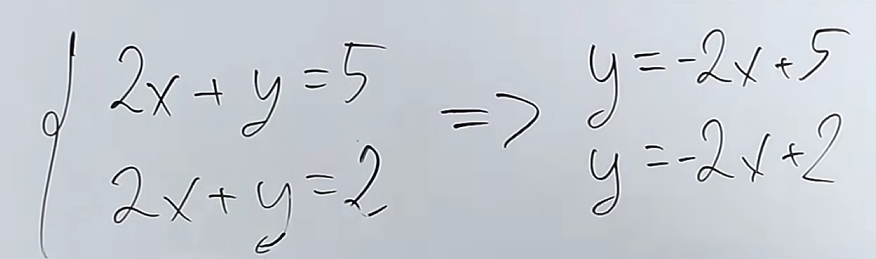
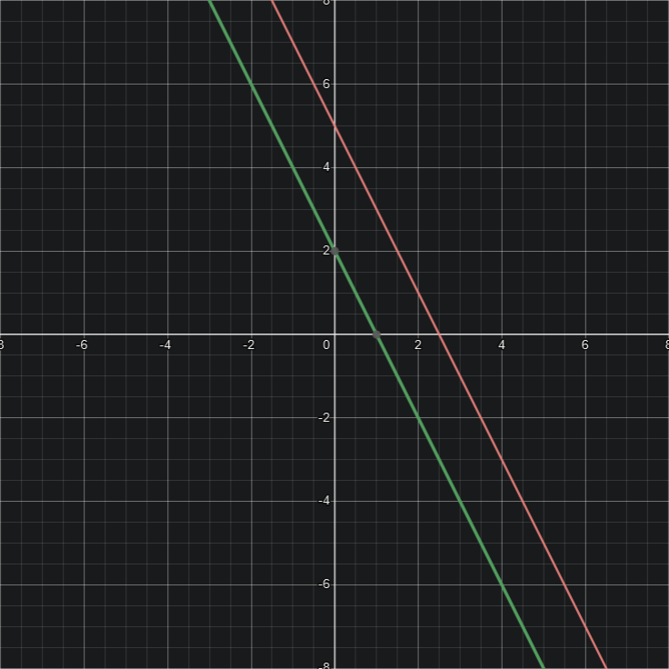
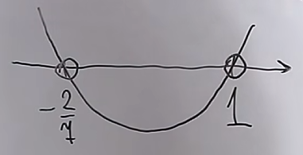
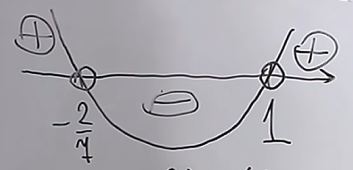

# Równania i nierówności
W równaniach i nierównościach w skrócie chodzi o wyliczenie niewiadomej "x"  

## Równania
$2(x+3) = 4 + x$  
$2x + 6 = 4 + x$  $/- x$  
$x + 6 = 4$  $/-6$  
$x = -2$  

### Sprawdzanie czy wyniki równania są prawidłowe
$3x + 2 = 11$  

$x_{1} = 3$  
$x_{2} = 5$  

$3 * 3 + 2 = 11$  
$9 + 2 = 11$  
$11 = 11$ ✅  

$3 * 5 + 2 = 11$  
$15 + 2 = 11$  
$17 \neq 11$ ❌  

## Nierówności
$3x + 2 > 4$  
$3x > 4 - 2$  
$3x > 2$  
$x > \frac{2}{3}$  

  
$x \in (\frac{2}{3}, \infty)$  

---

$3x + 2 \geqslant 4$  
$3x \geqslant 4 - 2$  
$3x \geqslant 2$  
$x \geqslant \frac{2}{3}$  

  
$x \in <\frac{2}{3}, \infty)$  

### Sprawdzanie czy wyniki nierówności są prawidłowe
$4x + 3 \geqslant 2$  

$x_{1} = 2$  
$x_{2} = -2$  

$4 * 2 + 3 \geqslant 2$  
$8 + 3 \geqslant 2$  
$11 \geqslant 2$ ✅  

$4 * (-2) + 3 \geqslant 2$  
$-8 + 3 \geqslant 2$  
$-5 \ngeqslant 2$  ❌  

## Równania i nierówności z wartością bezwzględną
$|x + 4| = 9$  
### Metoda geometryczna
Bierzemy liczbę z wartości bezwzględnej, która wyzeruje wartość w niej zawartą w tym przypadku będzie to -4 bo $-4 + 4 = 0$  

Następnie odejmujemy i dodajemy do niej wartość którą mamy wyliczyć, w tym przypadku będzie to 9

  

Bo $-4 - 9 = -13$ i $-4 + 9 = 5$  
Więc zbiór liczb, które spełniają równanie wygląda następująco: $x \in \{-13, 5\}$  

$|-13 + 4| = |-9| = 9$  
$|5 + 4| = |9| = 9$  
### Metoda algebraiczna (Rekomendowana)
Rekomendowana gdyż niektórych zadań nie da się rozwiązać metodą geometryczną  

$x + 4 = 9$ lub $x + 4 = -9$
$x = 9 - 4$ lub $x = -9 - 4$  
x = 5 lub x = -13

### Pułapka
$|x + 3| = -4$  

Zanim weźmiemy się za rozwiązywanie tego równania możemy zauważyć że naszym wynikiem ma być liczba ujemna, która nie może nam wyjść spod wartości bezwzględnej jest to **RÓWNANIE SPRZECZNE**  
## Układy równań
```math  
\left\{\begin{matrix}
2x + 5y = 12 \\ 3x + 2y = 7 
\end{matrix}\right. 
```
```math
\left\{\begin{matrix}
2x + 5y = 12 /*3 \\ 3x + 2y = 7 /*2 
\end{matrix}\right. 
```
```math
\left\{\begin{matrix}
6x + 15y = 36 \\ 6x + 4y = 14 
\end{matrix}\right.
```
```math
11y = 22
```
```math
y = 2
```
```math
2x = 12 - 5 * 2
```
```math
2x = 12 - 10
```
```math
2x = 2
```
```math
x = 1
```

<br>

```math
x = 1  
```
```math
y = 2
```
Ten x i y to współrzędne przecięcia się prostych w interpretacji geometrycznej
### Układ równań nieoznaczony
Ma nieskończenie wiele rozwiązań rozpoznajemy go przez fakt iż wyjdzie nam po prostu 0  
  

### Układ równań sprzeczny
Gdy wyjdzie nam wynik sprzeczny mamy do czynienia z układem sprzecznym  
  

### Interpretacja geometryczna układu równań
  

| x   | -1  | 0   | 1   |
| --- | --- | --- | --- |
| y   | 7   | 5   | 3   |

| x   | -1  | 0   | 1   |
| --- | --- | --- | --- |
| y   | 2   | 4   | 6   |

    
### Interpretacja geometryczna układu równań nieoznaczonego
  

| x   | -1  | 0   | 1   |
| --- | --- | --- | --- |
| y   | 7   | 5   | 3   |

  
### Interpretacja geometryczna układu równań sprzecznego
  

| x   | -1  | 0   | 1   |
| --- | --- | --- | --- |
| y   | 7   | 5   | 3   |

| x   | -1  | 0   | 1   |
| --- | --- | --- | --- |
| y   | 4   | 2   | 0   |

  

## Równania kwadratowe
$ax^{2} + bx + c = 0$  
$4x^{2} + 4x - 3 = 0$  

### Wzory
$\Delta = b^{2} - 4ac$
$x_1 = \frac{-b-\sqrt{\Delta}}{2a}$  
$x_2 = \frac{-b+\sqrt{\Delta}}{2a}$  

$x_{0}=  \frac{-b}{2a}$  

### Przykładowe rozwiązanie
$4x^{2} + 4x - 3 = 0$  

$a = 4$  
$b = 4$  
$c = -3$  

$\Delta = 4^{2} - 4 * 4 * (-3) = 16 + 48 = 64$  
$\sqrt{\Delta} = 8$  

$x_{1} = \frac{-4-8}{2*4} = \frac{-12}{8} = -1 \frac{1}{2}$  
$x_{2} = \frac{-4+8}{2*4} = \frac{4}{8} = \frac{1}{2}$  

### Liczba rozwiązań zależna od delty
| Delta        | Ilość rozwiązań |
| ------------ | --------------- |
| $\Delta > 0$ | 2 rozwiązania   |
| $\Delta = 0$ | 1 rozwiązanie   |
| $\Delta < 0$ | Brak rozwiązań  |
## Nierówności kwadratowe
$x(7x + 2) > 7x + 2$  
$7x^{2}+ 2x > 7x + 2$  
$7x^{2}+ 2x - 7x -2 > 0$  
$7x^{2}- 5x - 2 > 0$  

$\Delta = b^{2}- 4ac$  
$\Delta = (-5)^{2} - 4 * 7 * (-2) = 25 + 56 = 81$  
$\sqrt{\Delta} = 9$  

$x_{1}= \frac{-(-5)+9}{2*7} = \frac{14}{14} = 1$  
$x_{2}= \frac{-(-5)-9}{2*7} = \frac{-4}{14} = -\frac{2}{7}$  

Do tego momentu rozwiązujemy jak zwykłe równanie kwadratowe. Kolejnym krokiem jest sprawdzenie czy $a$ jest dodatnie czy ujemne. W tym przypadku $a = 7$ czyli jest dodatnie, co oznacza że na wykresie ramiona funkcji będą szły w górę.
> $a > 0$ - wykres ramionami do góry  
> $a < 0$ - wykres ramionami do dołu  

  

Zaznaczamy następnie to o co nas pytają czy wartości mają być ujemne czy dodatnie. W naszym przypadku będą to wartości dodatnie.  

  

**Więc:** $x \in (-\infty, -\frac{2}{7}) \sqcup (1, \infty)$  

Oczywiście nawiasy zależą od tego czego chcą w zadaniu. Ostre ("<" i ">") gdy pytają nas o wartości $\leqslant$ lub $\geqslant$ i zwykłe gdy pytają o wartości < lub >.  

**WAŻNE nawet gdy $\Delta$ jest ujemna nierówność kwadratowa ma rozwiązanie. x może należeć do zbioru pustego lub zbioru liczb rzeczywistych**  

## Równania wymierne
$\frac{x-3}{x+4} = 0$  
Pierwszym krokiem przy równaniu wymiernym jest zrobienie założeń. Oznacza to że mianownik naszego równania musi być różne od zera.  

Z: $x + 4 \neq 0$  
Z: $x \neq -4 \leftarrow$ Nasze rozwiązanie nie może równać się -4  

Następnie przystępujemy do rozwiązania.
$\frac{x-3}{x+4} = 0$  /$*$ $(x+4)$  
$x - 3 = 0$  
$x = 3 \leftarrow$ Rozwiązanie równania  

### Przykładowe rozwiązania
$\frac{(x-1)(x+2)}{x-3} = 0$  

Z: $x - 3 \neq 0$  
Z: $x \neq 3$  

$\frac{(x-1)(x+2)}{x-3} = 0$  / $*$ $(x - 3)$    
$(x-1)(x+2) = 0$  
#### 1 sposób
$x^{2} + 2x -x -2 = 0$  
$x^{2}+x-2 = 0 \leftarrow$ Widzimy, że powstało nam równanie kwadratowe, czyli dalej delta

$\Delta = (-1)^{2} - 4 * 1 * (-2) = 1 + 8 = 9$  
$\sqrt{\Delta} = 3$  

$x_{1} = \frac{-1-3}{2*1} = \frac{-4}{2} = -2$  
$x_{2} = \frac{-1+3}{2*1} = \frac{2}{2} = 1$  

$x \in \{-2,1\}$  
#### 2 sposób
$(x-1)(x+2) = 0$  
$x_1 - 1 = 0$  
$x_1 = 1$  

$x_{2} + 2 = 0$  
$x_{2} = -2$  

$x_{1}= 1$  
$x_{2}= -2$  

$x \in \{-2,1\}$  