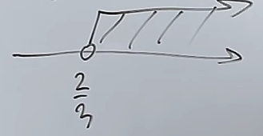
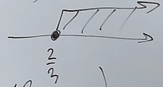
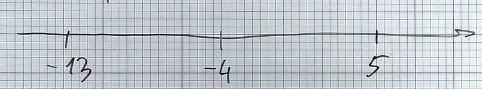

# Równania i nierówności
W równaniach i nierównościach w skrócie chodzi o wyliczenie niewiadomej "x"  

## Równania
$2(x+3) = 4 + x$  
$2x + 6 = 4 + x$  $/- x$  
$x + 6 = 4$  $/-6$  
$x = -2$  

### Sprawdzanie czy wyniki równania są prawidłowe
$3x + 2 = 11$  

$x_{1} = 3$  
$x_{2} = 5$  

$3 * 3 + 2 = 11$  
$9 + 2 = 11$  
$11 = 11$ ✅  

$3 * 5 + 2 = 11$  
$15 + 2 = 11$  
$17 \neq 11$ ❌  

## Nierówności
$3x + 2 > 4$  
$3x > 4 - 2$  
$3x > 2$  
$x > \frac{2}{3}$  

  
$x \in (\frac{2}{3}, \infty)$  

---

$3x + 2 \geqslant 4$  
$3x \geqslant 4 - 2$  
$3x \geqslant 2$  
$x \geqslant \frac{2}{3}$  

  
$x \in <\frac{2}{3}, \infty)$  

### Sprawdzanie czy wyniki nierówności są prawidłowe
$4x + 3 \geqslant 2$  

$x_{1} = 2$  
$x_{2} = -2$  

$4 * 2 + 3 \geqslant 2$  
$8 + 3 \geqslant 2$  
$11 \geqslant 2$ ✅  

$4 * (-2) + 3 \geqslant 2$  
$-8 + 3 \geqslant 2$  
$-5 \ngeqslant 2$  ❌  

## Równania i nierówności z wartością bezwzględną
$|x + 4| = 9$  
### Metoda geometryczna
Bierzemy liczbę z wartości bezwzględnej, która wyzeruje wartość w niej zawartą w tym przypadku będzie to -4 bo $-4 + 4 = 0$  

Następnie odejmujemy i dodajemy do niej wartość którą mamy wyliczyć, w tym przypadku będzie to 9

  

Bo $-4 - 9 = -13$ i $-4 + 9 = 5$  
Więc zbiór liczb, które spełniają równanie wygląda następująco: $x \in \{-13, 5\}$  

$|-13 + 4| = |-9| = 9$  
$|5 + 4| = |9| = 9$  
### Metoda algebraiczna (Rekomendowana)
Rekomendowana gdyż niektórych zadań nie da się rozwiązać metodą geometryczną  

$x + 4 = 9$ lub $x + 4 = -9$
$x = 9 - 4$ lub $x = -9 - 4$  
x = 5 lub x = -13

### Pułapka
$|x + 3| = -4$  

Zanim weźmiemy się za rozwiązywanie tego równania możemy zauważyć że naszym wynikiem ma być liczba ujemna, która nie może nam wyjść spod wartości bezwzględnej jest to **RÓWNANIE SPRZECZNE**  
## Układy równań
```math  
\left\{\begin{matrix}
2x + 5y = 12 \\ 3x + 2y = 7 
\end{matrix}\right. 
```
